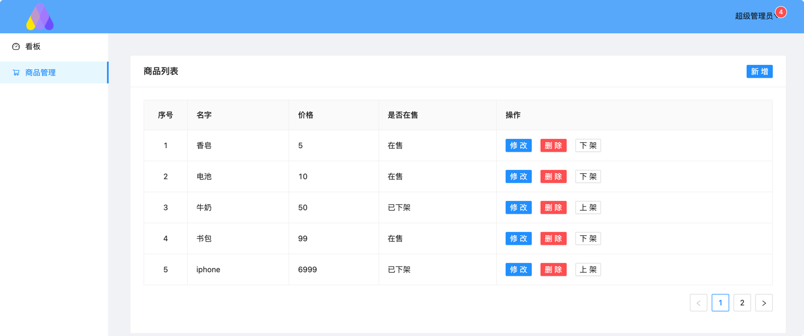
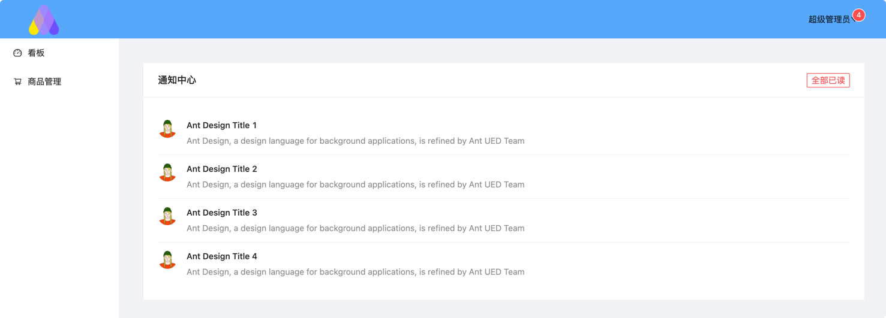

## React练手项目
#### 框架
- Antd 4.17.2  前端组件库
- react-router-dom 5.3.0 路由库
- axios 请求库

#### 功能&知识点

- 登录+注销逻辑
- 通知中心
- 商品编辑、删除、下架
- braft-editor 富文本编辑器
- react-router-dom 路由
- useState/useEffect Hook函数
- redux/react-redux/redux-thunk 组件传参和异步
- redux-logger/redux-devtools-extension 调试工具

#### 快速启动

```shell
npm install
npm start
```

#### Demo
商品管理

通知中心


## 其他

#### api数据模拟

```
www.fastmock.site
```

## 持续补充中